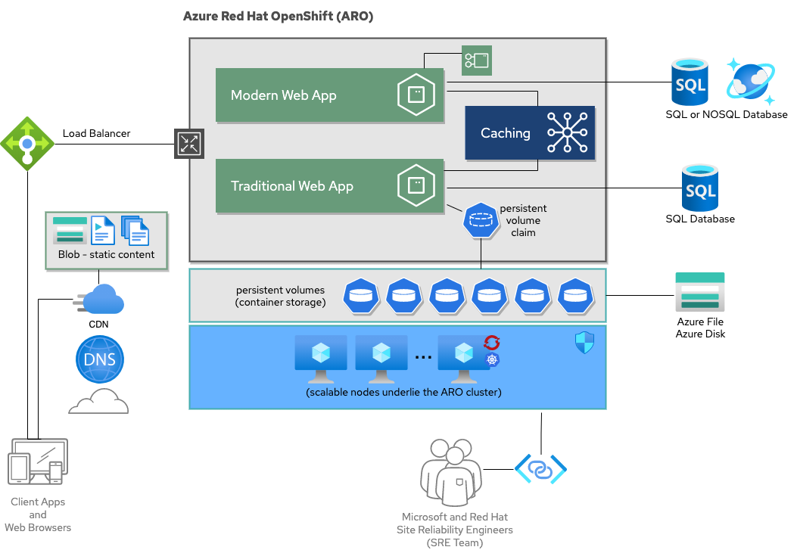

# DRAFT UNDER CONSTRUCTION

# OpenShift Examples - ARO WebApp with Azure SQL
A demo of deploying highly available webapps in Azure Red Hat OpenShift (ARO) that talk to cloud databases (Azure Cosmos DB & Azure SQL).

**PLEASE BE AWARE** that ARO + Azure SQL + Cosmos DB running in HA mode is closer to production Azure costs than a typical example's "Hello World" level of costs.

This example is based on the solution architecture diagram below:

## Implementation Details

Folder structure:

- `/modern-app`: a modern backend API (supporting OpenAPI) and a webpacked frontend UI
- `/traditional-appserver`: the config and code for the traditional app server
- `/database`: the scripts needed to setup the Azure SQL database
- `/caching`: how to setup a caching service running in ARO

## Setup Databases
Assuming you have CLI access to your Azure account. Run the following commands to create a our databases for this example:

1. Check the script in database/setupAzureSql.sh and tweak as desired
2. Run `./database/setupAzureSql.sh`

3. Check the script in database/setupCosmos.sh and tweak as desired
4. Run `./database/setupCosmos.sh`
5. Note the connection strings that are printed - you'll need the primary one later

If you are completely new to Azure SQL and need a little more help, here's a full playlist that will help you: [Azure SQL for beginners](https://www.youtube.com/playlist?list=PLlrxD0HtieHi5c9-i_Dnxw9vxBY-TqaeN).

## Deploy Apps
1. If you haven't already, in your Azure account [create an ARO cluster](https://docs.microsoft.com/en-us/azure/openshift/tutorial-create-cluster)
2. If you haven't already, clone this github repo to your local machine (this is so you can tweak things before you deploy)
3. Login to ARO and create a new project to deploy this example (you can do via webconsole or CLI:`oc new-project`)
4. Follow steps to deploy the modern-webapp-api service
5. Follow steps to deploy the modern-webapp-ui app
6. Follow steps to deploy one of the traditional monolithic apps
7. Goto the ARO webconsole and check it all out

## This is a lot of manual steps
Yes, sorry. But it is intentional - I wanted to walk you through everything to help you understand all the parts. I'm planning on another example to show how you can automate all of these steps with CI/CD. If you want a sneak peak on how that could work [read this blog post](https://developers.redhat.com/blog/2020/09/03/the-present-and-future-of-ci-cd-with-gitops-on-red-hat-openshift/).